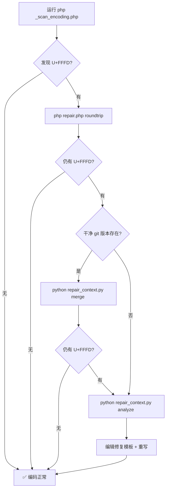

# Encoding 编码工具集

项目文件必须使用 **UTF-8 无 BOM** 编码。本工具集用于检测和修复编码问题。

---

## 工具一览

| 工具 | 说明 |
|------|------|
| `_scan_encoding.php` | 项目级编码扫描（根目录入口） |
| `tools/encoding/repair.php` | PHP 修复工具（CP936 回环 + 分析） |
| `tools/encoding/repair_context.py` | Python 深度修复（上下文重写 + 三路合并） |

---

## 快速使用

### 1. 扫描项目

```bash
# 扫描整个项目
php _scan_encoding.php

# JSON 格式输出（供程序处理）
php _scan_encoding.php --json

# 分析单个文件的 U+FFFD 上下文
php _scan_encoding.php --analyze path/to/file.php
```

### 2. 修复乱码

#### 策略 A — CP936 回环修复（推荐首选）

适用：纯双重编码乱码（带 U+FFFD 也可尝试，会减少但不能完全消除）

```bash
# 方式一：从根目录入口
php _scan_encoding.php --fix path/to/file.php

# 方式二：用专用工具
php tools/encoding/repair.php roundtrip path/to/file.php
```

**原理：** 当 UTF-8 文件被错误以 GBK/CP936 方式读取并保存后，中文被双重编码。将文件通过 CP936 编码再 UTF-8 解码可以逆转这一过程。

```
原始 UTF-8:      布局引擎  (UTF-8 字节序列)
被当 CP936 解码: 闂革綅寮曟搾  (乱码)
CP936 roundtrip: 布局引擎  (恢复)
```

```
原始 UTF-8:      布局引擎  (UTF-8 bytes: E5 B8 83 E5 B1 80...)
     ↓ 被错误保存为 CP936
已损坏 UTF-8:    闂革綅寮曟搾  (UTF-8 bytes reinterpreted as CP936)
     ↓ CP936 roundtrip
     cp936_encode(损坏UTF-8) → 恢复原始字节
     utf8_decode(原始字节)  → 布局引擎
```

#### 策略 B — 三路合并（需要 git 历史）

适用：有干净参考版本的注释乱码（文件能在 git 中找到未损坏的中文版本）

```bash
# 从 HEAD 版本合并中文注释
python tools/encoding/repair_context.py merge path/to/file.php

# 从指定 commit 合并
python tools/encoding/repair_context.py merge path/to/file.php <commit-ref>
```

**原理：** 将损坏版本与 git 中的干净版本进行行匹配，使用 **ASCII 词重叠** 算法匹配结构相似的行，用干净版本的中文替换损坏版本的同结构行。

#### 策略 C — 上下文重写（最终手段）

适用：U+FFFD 残留行在用户新增代码区域，无干净参考

```bash
# 第一步：分析 U+FFFD 并生成修复模板
python tools/encoding/repair_context.py analyze path/to/file.php
# 这会在同目录生成 file_fix.py

# 第二步：编辑修复模板，填写正确中文
# 打开 file_fix.py，修改每行的中文注释

# 第三步：应用修复
python tools/encoding/repair_context.py rewrite path/to/file.php file_fix.py
```

**原理：** 对于 CP936 回环无法恢复的 U+FFFD（部分字节已永久丢失），通过分析上下文（周围代码）推断注释内容，手动重新填写。这种方法适用于所有残留情况。

---

## 乱码识别速查

| 特征 | 含义 | 处理 |
|------|------|------|
| `锟斤拷` | 确凿的 GBK→UTF-8 双重编码 | CP936 回环 |
| `U+FFFD (�)` | 字节永久丢失 | 上下文重写 |
| 文件含 BOM | 非标准 UTF-8 头部标记 | 用编辑器去 BOM |
| `�?运��?` | 部分恢复的混合乱码 | 先回环再重写 |

---

## 工作流建议



---

## 常见问题

**Q: CP936 回环后文件变大了？**
A: 正常。CP936 编码可能产生不同的字节长度，通常变化 <5%。

**Q: 修复后代码逻辑会受影响吗？**
A: 三种策略都只修改**注释行**（`//` 和 `/** */` 中的中文），不影响代码逻辑。

**Q: 什么时候应该用哪种策略？**
A: 先尝试策略 A (roundtrip)，如果仍有残留且文件有 git 历史用策略 B (merge)，否则用策略 C (rewrite)。
